# REST-API-RECONCILIATION

# Mermaid Diagrams for Production Async Sync Pattern

## 1. Overall Async Sync Flow

```mermaid
sequenceDiagram
    participant User
    participant Salesforce UI
    participant Apex Controller
    participant Queueable Job
    participant Master API
    participant Database
    participant Platform Event

    User->>Salesforce UI: Update Account
    Salesforce UI->>Apex Controller: Save changes
    Apex Controller->>Database: Update Account (Status: PENDING)
    Apex Controller->>Queueable Job: Enqueue AsyncSyncJob
    Apex Controller-->>User: ✅ Saved (immediate response)
    
    Note over User,Salesforce UI: User can continue working
    
    Queueable Job->>Database: Update Status → PROCESSING
    Queueable Job->>Master API: PUT /accounts/{id}
    
    alt Success
        Master API-->>Queueable Job: 200 OK + Full Object
        Queueable Job->>Queueable Job: Validate Response
        Queueable Job->>Queueable Job: Check Version
        Queueable Job->>Database: Update Account + Status → SYNCED
        Queueable Job->>Platform Event: Publish Success Event
        Platform Event-->>User: 🔔 Sync Complete
    else API Error
        Master API-->>Queueable Job: 500 Server Error
        Queueable Job->>Database: Update Status → ERROR
        Queueable Job->>Queueable Job: Schedule Retry
        Queueable Job->>Platform Event: Publish Error Event
        Platform Event-->>User: ⚠️ Sync Failed (will retry)
    else Validation Error
        Master API-->>Queueable Job: 200 OK + Invalid Data
        Queueable Job->>Queueable Job: Data Validation Failed
        Queueable Job->>Database: Update Status → VALIDATION_FAILED
        Queueable Job->>Platform Event: Publish Validation Error
        Platform Event-->>User: ❌ Data Issue (manual review)
    end
```

## 2. Job State Machine

## 3. Error Handling & Retry Logic

## 4. Complete System Architecture

## 5. Data Validation Pipeline

## 6. Reconciliation Process Flow

## 7. Monitoring Dashboard Data Flow

## 8. Retry Strategy with Exponential Backoff

## 9. Version Conflict Detection & Resolution

## 10. Complete Timeline View

```mermaid
sequenceDiagram
    autonumber
    participant User
    participant UI
    participant Apex
    participant Queue as Queueable Job
    participant API as Master API
    participant DB as Salesforce DB
    participant PE as Platform Event

    Note over User,UI: T+0s: User Action
    User->>UI: Edit record
    UI->>Apex: Save request
    
    Note over Apex,DB: T+0.5s: Initial Save
    Apex->>DB: Update (Status: PENDING)
    Apex->>Queue: Enqueue AsyncSyncJob
    Apex-->>UI: Success response
    UI-->>User: ✅ Saved (continue working)
    
    Note over Queue,API: T+2s: Background Processing
    Queue->>DB: Update (Status: PROCESSING)
    Queue->>API: PUT /accounts/{id}
    
    Note over API: T+2.5s: Master Processing
    API->>API: Query database (300ms)
    API->>API: Update record (100ms)
    API-->>Queue: 200 OK + Full Object (500ms total)
    
    Note over Queue: T+3s: Validation (200ms)
    Queue->>Queue: Parse JSON (50ms)
    Queue->>Queue: Validate fields (50ms)
    Queue->>Queue: Check version (50ms)
    Queue->>Queue: Verify checksum (50ms)
    
    Note over Queue,DB: T+3.2s: Update Salesforce
    Queue->>DB: Update record (100ms)
    Queue->>DB: Update Status: SYNCED
    Queue->>PE: Publish success event (50ms)
    
    Note over PE,User: T+3.4s: Notification
    PE-->>UI: Event received
    UI-->>User: 🔔 Sync complete!
    
    Note over Queue: T+3.2s: Background (parallel)
    Queue->>DB: Log sync event
    Queue->>DB: Update metrics
```

---

These diagrams cover:
1. **Sequence diagram** - User interaction flow
2. **State machine** - Job lifecycle states
3. **Flowchart** - Error handling logic
4. **Architecture** - Complete system overview
5. **Validation pipeline** - Data quality checks
6. **Reconciliation** - Weekly audit process
7. **Monitoring** - Dashboard data flow
8. **Retry logic** - Exponential backoff
9. **Conflict resolution** - Version management
10. **Timeline** - End-to-end timing

You can copy these into any Mermaid-compatible tool (Markdown editors, Mermaid Live Editor, Notion, GitHub, etc.) to visualize the complete async sync architecture! 🎨
